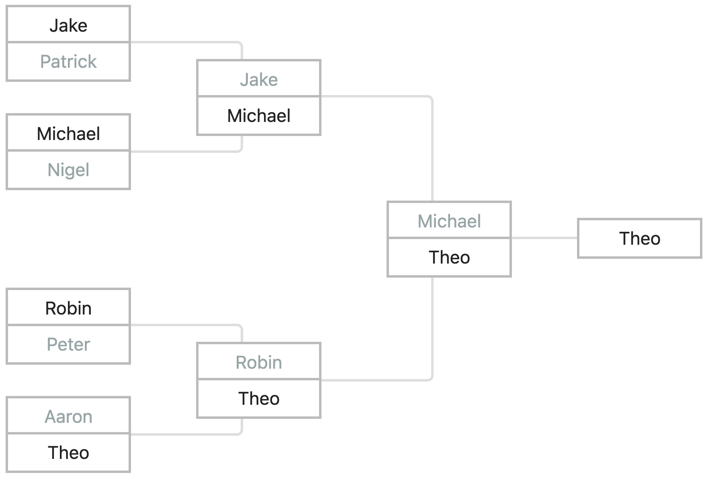

# Kuppy

**Kuppy** is a minimal JavaScript library for building interactive cup brackets (e.g. 8-player single elimination). It works with plain HTML and lets you programmatically or interactively move players through the rounds.

Originally built in 2013. Cleaned up in 2025.



### 🛠️ Why I built it

Back in 2013, I was building a multiplayer online learning game as part of my university studies. The game featured a knockout tournament where students competed in a math challenge. Each match consisted of two players going head-to-head. Both were shown five questions — things like `1 × 5`, `6 × 3`, or `2 × 6` — and the player who answered more correctly (or faster) won the match.

The winner advanced to the next round. The loser was eliminated but could join a new tournament. It was like *Battlefield*, but with mathematics!

I needed a way to render the tournament bracket, but there were no good open-source libraries at the time. So I built my own. That library eventually became Kuppy.

### ✨ Features

- Supports any power-of-two number of players (4, 8, 16, 32, …)
- Add players programmatically
- Advance winners by clicking on their names
- Requires jQuery

### 🚀 Usage

Install via npm

```bash
npm install @juhawilppu/kuppy
```

Add DOM element
```html
<div id="tournament"></div>
```

Then use

```js
import kuppy from '@juhawilppu/kuppy';
const bracket = new kuppy({ elementId: '#tournament', numberOfPlayers: 8 });

bracket.addPlayer(1, 1, 'UPPER', 'Jake');
bracket.addPlayer(1, 1, 'BOTTOM', 'Patrick');
// ...
```

### 👨🏻‍💻 How to develop locally

To work on kuppy locally:

```bash
npm install
npx vite demo
```

This starts a local dev server at http://localhost:5173/ and opens the demo page.