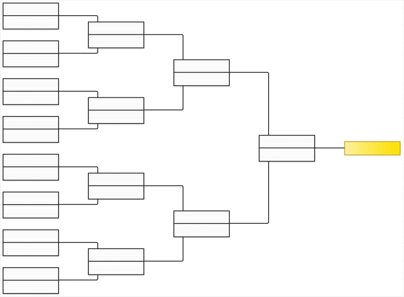

# Kuppy

**Kuppy** is a lightweight JavaScript library for building interactive cup brackets (e.g. 16-player single elimination).

It lets you programmatically or interactively move players through the rounds.

Originally built in 2013. Refined in 2025.

👇 Here’s Kuppy rendering the 2022 FIFA World Cup knock-out stage:



### 🛠️ Background

Back in 2013, I was building a multiplayer online learning game as part of my university studies. The game featured a knockout tournament where students competed in math challenges, advancing through rounds until one winner remained. There were no suitable open-source libraries for rendering tournament brackets, so I built my own. That library later became Kuppy.

---

### ✨ Features

- Supports any power-of-two number of players (8, 16, 32, …, up to 512+)
- Add players programmatically
- Advance winners by clicking on their names
- Plain JavaScript + jQuery (no framework required)

---

### 📦 Requirements

- **ES modules** — Requires a modern bundler (Vite, Webpack, Rollup, etc.)
- **jQuery** — Required as a dependency

---

### 🚀 Usage

**Install via npm:**

```bash
npm install @juhawilppu/kuppy
```

**Add a container element:**
```html
<div id="tournament"></div>
```

**Import and initialize Kuppy:**

```js
import Kuppy from '@juhawilppu/kuppy';
import '@juhawilppu/kuppy/dist/kuppy.css';

const bracket = new Kuppy({
    elementId: '#tournament',
    numberOfPlayers: 16
});
```

**Add players:**

```js
bracket.addPlayer(1, 1, 'UPPER', 'Jake');
bracket.addPlayer(1, 1, 'BOTTOM', 'Patrick');
```

**Parameters for `addPlayer(round, pair, position, name)`:**
- `round`: Round number (starting from `1`)
- `pair`: Pair number within the round (starting from `1`)
- `position`: `UPPER` or `BOTTOM` (top or bottom in the pair)
- `name`: Name of the player or team

### 👨🏻‍💻 How to develop locally

```bash
npm install
npx vite demo
```

Starts a local dev server at http://localhost:5173/ with the demo page.